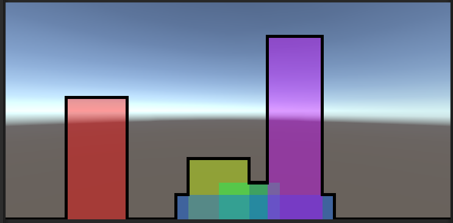

Skyline
=======

This project provides a template for the Skyline problem in Unity 3D and also a naive solution in the "solution" branch

Problem description
-------------------
https://briangordon.github.io/2014/08/the-skyline-problem.html

Project structure
-----------------
The CityController is responsible for setting up the scene with the buildings and the points of change in the skyline. It currently provides a list of buildings that will result in the image below and a hardcoded list of PointOfChange called "skyline". You should change this code to provide a list that is calculated dynamically based on the buildings list.

Desired output
--------------
